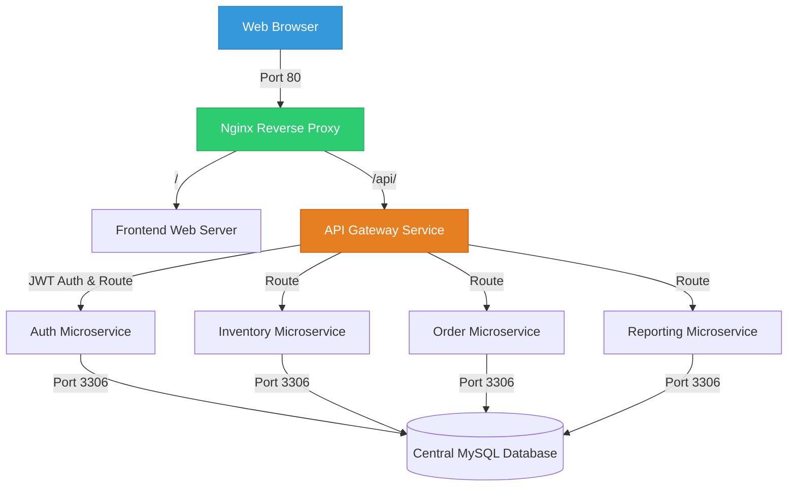

# BookHive ERP: A Microservices-Backed Bookstore Enterprise Resource Planning (ERP) System

---

## 🎓 Academic Metadata
* **Course/Subject:** ITSAR2 (Information Technology System Architecture & Integration 2)
* **Year & Section:** BSIT 3B
* **Instructor:** Engr. Joao Roumil Vergara
* **Development Team (Group Members):**
  1. **Roma, Sean Justin** (Lead Developer & System Architect)
  2. **Bermejo, Kate Nicole** (Backend Developer & Microservices Engineer)
  3. **Andura, Carla** (Database Administrator & System Integration)
  4. **Garcia, Sophia Christi** (Frontend Developer & UI/UX Designer)
  5. **Labrador, Mariene** (Quality Assurance & Documentation Specialist)

---

## 🏗️ Architectural System Overview

BookHive ERP is a highly decoupled, modern microservices-based system designed to manage a bookstore's enterprise operations. By breaking down traditional monolithic database structures and application logic, BookHive isolates distinct business contexts into specialized, lightweight microservices.



### 🛰️ Central API Gateway (`api-gateway/`)
Acts as the single entry point for all client requests. It handles dynamic service routing, CORS headers, and JWT verification for protected resources.
- **Routing**: Rewrites `/api/foo` paths to microservice-internal locations.
- **Security**: Intercepts protected requests and extracts the `Authorization: Bearer <Token>` header, using a custom cryptographic helper to verify the JWT and enforce Role-Based Access Control (RBAC).

### ⚙️ Containerized Microservices
1. **Auth Service (`auth-service/`)**: Manages secure member registration and logins. Responsible for query execution, password hashing, and generating cryptographic JSON Web Tokens (JWT) containing user identifiers and security roles.
2. **Inventory Service (`inventory-service/`)**: Manages the catalog of books, authors, categories, and real-time stock management. Includes dynamic, secure over-the-counter stock deduction triggers.
3. **Order Service (`order-service/`)**: Powers the cart checkout and OTC (Over-The-Counter) transaction lifecycle. Tracks order status updates and automatically communicates with the Inventory Service to deduct items upon checkout.
4. **Reporting Service (`reporting-service/`)**: Aggregates sales and daily revenue history from transactional records to feed real-time visual charts on the administrative dashboard.

### 💻 Legacy Frontend Client (`frontend/`)
A responsive Bootstrap 3 and jQuery web interface acting as the client storefront and internal staff portal.
- **Client Features**: Interactive book browsing, real-time inventory counts, and catalog category filtering.
- **Staff Portals**: Role-based access screens for Cashiers (POS checkout), Stock Clerks (Inventory management), Fulfillment staff (Order status updates), and Administrators (System reports & analytics).

---

## 🛠️ Technology Stack

| Component | Technology | Description |
| :--- | :--- | :--- |
| **Reverse Proxy** | Nginx | Manages ingress traffic and isolates routing pathways |
| **API Gateway** | PHP 8.2 + Apache | Dynamic routing, custom JWT verification, and REST architecture |
| **Microservices** | PHP 8.2 (Procedural) | Decoupled business logic backend services |
| **Database** | MySQL 8.0 | Decoupled logical schemas initialized via strict `db-init/` SQL |
| **Frontend** | PHP 8.2 + Bootstrap 3 + jQuery | Legacy client interfaces connecting asynchronously to the Gateway |
| **Security** | JSON Web Tokens (JWT) | Stateless token-based security containing user claims |
| **Containerization**| Docker & Docker Compose | Multi-container environment orchestration |

---

## 🔒 Security & Data Integrity Standard
1. **SQL Injection Prevention**: All database interaction queries involving user inputs strictly utilize **MySQLi Prepared Statements** with parameterized parameter binding (`bind_param`).
2. **Stateless Authorization**: Protected REST API routes are fully secured. If the client does not provide a valid, cryptographically signed JWT, the API Gateway blocks the request and returns an HTTP `401 Unauthorized` status.
3. **Database Isolation**: The system separates concerns across distinct databases (`erp_auth`, `erp_inventory`, `erp_orders`). Each microservice has boundary access, reinforcing data isolation principles.

---

## 🚀 Setup & Development Workflow

The application supports a seamless transition between local development (XAMPP/localhost) and production/staging (Docker).

### 🔄 Environment Toggle
The system includes self-healing, automatic environment detection in `config.php`:
```php
$is_production = (getenv('APP_ENV') === 'production') || file_exists('/.dockerenv');
```
- **`$is_production = false` (XAMPP)**: Automatically resolves hosts to `127.0.0.1` and uses local absolute paths (e.g. `http://localhost/bookstore-erp/`).
- **`$is_production = true` (Docker)**: Automatically detects when running inside a container. It resolves database hosts to `database` and uses internal Docker service endpoints (`http://inventory-service`, `http://auth-service`, etc.).

---

### 🐳 Quick Start with Docker (Recommended)

To run the entire microservice stack locally or on a cloud server (such as a Digital Ocean droplet) in a fully containerized environment:

#### 1. Pre-requisites
Ensure you have **Docker** and **Docker Compose** installed on your host machine.

#### 2. Start the Stack
Navigate to the root directory and boot up the containers:
```bash
docker compose up --build -d
```
This single command builds all custom PHP/Apache microservice images, configures Nginx, mounts database initialization scripts, creates isolated networks, and launches the full ERP stack.

#### 3. Access the Application
Open your browser and navigate to:
- **Frontend Client:** `http://localhost/` (or your server's IP address)
- **API Gateway:** `http://localhost/api/gateway.php`

---

### 📂 Repository & Project Structure
```
bookstore-erp/
│
├── api-gateway/            # Central router, handles REST requests & JWT validation
├── auth-service/           # Member registration, logins, and token generation
├── inventory-service/      # Book catalog, author catalogs, and stock deduction
├── order-service/          # Transaction manager, carts, and checkout processing
├── reporting-service/      # Daily revenue logs and system-wide analytics
├── frontend/               # User storefront client, dashboard panels, and POS UI
│   ├── includes/           # Header, footer, sidebar navigation, and logging utils
│   └── set_session.php     # Session synchronizer bridging container boundaries
│
├── proxy/                  # Nginx Reverse Proxy routing configuration
├── db-init/                # MySQL schemas and seeds loaded on DB boot
├── config.php              # Global environment toggles (Local XAMPP vs Docker)
├── docker-compose.yml      # Orchestrates all 8 services in the system
└── README.md               # Course and architecture documentation
```

---

## 👤 Role-Based Access Control (RBAC) System Manual

To facilitate complete system testing across all role-based authorization portals, the database is pre-seeded with specialized accounts. You can log in on the **Secure Login (`/login.php`)** page with these credentials to experience different workflows:

### 🔑 Demo Credentials Directory

| User Role | Seeded Member | Username / Email | Password | Assigned Portal Screen & Privileges |
| :--- | :--- | :--- | :--- | :--- |
| **Admin** | Miguel Santos | **`admin@bookhive.com`** | `password123` | `admin.php` / `reports.php` (Full DB Read/Write, Manage Staff, System-wide Analytics) |
| **Supervisor** | Teresa Magbanua | **`supervisor@bookhive.com`** | `password123` | `staff.php` (View Staff, Issue Sales Audits & Refunds) |
| **Stock Clerk** | Paolo Reyes | **`stockclerk@bookhive.com`** | `password123` | `staff_inventory.php` (Real-Time Catalog Manager, Add/Edit Book Stock counts) |
| **Fulfillment** | Jeric Bautista | **`fulfillment@bookhive.com`** | `password123` | `staff_orders.php` (Update Order Status pipeline from Pending to Shipped) |
| **Cashier** | Carmela Mendoza | **`cashier@bookhive.com`** | `password123` | `staff_pos.php` (Over-the-counter POS cashier interface) |
| **Customer** | James Dela Cruz | **`james@gmail.com`** | `password123` | `shop.php` (Browse catalog, place OTC orders, track shipments on `my_orders.php`) |
| **Customer** | Kate Nicole | **`katenicolebermejo84@gmail.com`** | `hihello05` | `shop.php` (Browse catalog, place OTC orders, track shipments on `my_orders.php`) |

