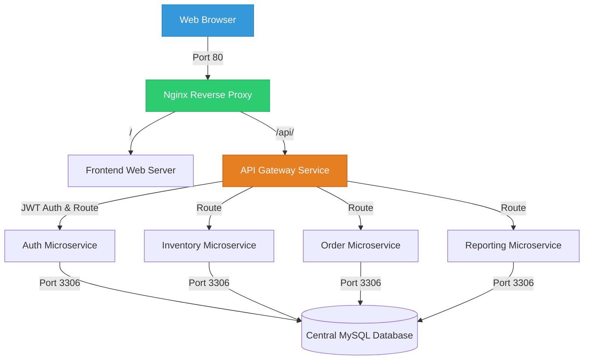

# BookHive ERP: A Microservices-Backed Bookstore Enterprise Resource Planning (ERP) System

---

## 🌐 Live Deployment

> The system is fully deployed and publicly accessible on a DigitalOcean cloud server.

| Resource | URL |
| :--- | :--- |
| **🛍️ Frontend (Bookstore)** | [http://129.212.231.122/](http://129.212.231.122/) |
| **🔐 Login Portal** | [http://129.212.231.122/login.php](http://129.212.231.122/login.php) |
| **⚙️ API Gateway** | [http://129.212.231.122/api/gateway.php](http://129.212.231.122/api/gateway.php) |

> **⚠️ If the site is down or login is not working**, refer to the **[TROUBLESHOOTING.md](./TROUBLESHOOTING.md)** guide for step-by-step recovery instructions.

---

## 🎓 Academic Metadata

* **Course/Subject:** ITSAR2 (Information Technology System Architecture & Integration 2)
* **Year & Section:** BSIT 3B
* **Instructor:** Engr. Joao Roumil Vergara
* **Development Team:**

| # | Name | Role |
| :--- | :--- | :--- |
| 1 | **Roma, Sean Justin** | Lead Developer & System Architect |
| 2 | **Bermejo, Kate Nicole** | Backend Developer & Microservices Engineer |
| 3 | **Andura, Carla** | Database Administrator & System Integration |
| 4 | **Garcia, Sophia Christi** | Frontend Developer & UI/UX Designer |
| 5 | **Labrador, Mariene** | Quality Assurance & Documentation Specialist |

---

## 🏗️ Architectural System Overview

BookHive ERP is a highly decoupled, modern microservices-based system designed to manage a bookstore's enterprise operations. By breaking down traditional monolithic database structures and application logic, BookHive isolates distinct business contexts into specialized, lightweight microservices.



### 🛰️ Central API Gateway (`api-gateway/`)
Acts as the single entry point for all client requests. It handles dynamic service routing, CORS headers, and JWT verification for protected resources.
- **Routing**: Rewrites `/api/foo` paths to microservice-internal locations.
- **Security**: Intercepts protected requests and extracts the `Authorization: Bearer <Token>` header, using a custom cryptographic helper to verify the JWT and enforce Role-Based Access Control (RBAC).

### ⚙️ Containerized Microservices
1. **Auth Service (`auth-service/`)**: Manages secure member registration and logins. Responsible for query execution, password hashing, and generating cryptographic JSON Web Tokens (JWT) containing user identifiers and security roles.
2. **Inventory Service (`inventory-service/`)**: Manages the catalog of books, authors, categories, and real-time stock management. Includes dynamic, secure over-the-counter stock deduction triggers.
3. **Order Service (`order-service/`)**: Powers the cart checkout and OTC (Over-The-Counter) transaction lifecycle. Tracks order status updates and automatically communicates with the Inventory Service to deduct items upon checkout.
4. **Reporting Service (`reporting-service/`)**: Aggregates sales and daily revenue history from transactional records to feed real-time visual charts on the administrative dashboard.

### 💻 Legacy Frontend Client (`frontend/`)
A responsive Bootstrap 3 and jQuery web interface acting as the client storefront and internal staff portal.
- **Client Features**: Interactive book browsing, real-time inventory counts, and catalog category filtering.
- **Staff Portals**: Role-based access screens for Cashiers (POS checkout), Stock Clerks (Inventory management), Fulfillment staff (Order status updates), and Administrators (System reports & analytics).

---

## 🛠️ Technology Stack

| Component | Technology | Description |
| :--- | :--- | :--- |
| **Hosting** | DigitalOcean Droplet (Ubuntu 24.04) | Cloud VPS running the full containerized stack |
| **Reverse Proxy** | Nginx | Manages ingress traffic and isolates routing pathways |
| **API Gateway** | PHP 8.2 + Apache | Dynamic routing, custom JWT verification, and REST architecture |
| **Microservices** | PHP 8.2 (Procedural) | Decoupled business logic backend services |
| **Database** | MySQL 8.0 | Decoupled logical schemas initialized via strict `db-init/` SQL |
| **Frontend** | PHP 8.2 + Bootstrap 3 + jQuery | Legacy client interfaces connecting asynchronously to the Gateway |
| **Security** | JSON Web Tokens (JWT) | Stateless token-based security containing user claims |
| **Containerization** | Docker & Docker Compose | Multi-container environment orchestration |

---

## 🔒 Security & Data Integrity Standard

1. **SQL Injection Prevention**: All database interaction queries involving user inputs strictly utilize **MySQLi Prepared Statements** with parameterized parameter binding (`bind_param`).
2. **Stateless Authorization**: Protected REST API routes are fully secured. If the client does not provide a valid, cryptographically signed JWT, the API Gateway blocks the request and returns an HTTP `401 Unauthorized` status.
3. **Database Isolation**: The system separates concerns across distinct databases (`erp_auth`, `erp_inventory`, `erp_orders`). Each microservice has boundary access, reinforcing data isolation principles.

---

## 🛡️ Production Resiliency & Self-Healing

The production Docker Compose configuration has been hardened with three layers of protection to ensure the system stays online:

| Protection | Configuration | Effect |
| :--- | :--- | :--- |
| **Auto-Restart Policy** | `restart: unless-stopped` on all services | Docker automatically revives any crashed container within seconds |
| **MySQL Memory Tuning** | `--innodb-buffer-pool-size=64M`, `--max-connections=50` | Reduces MySQL RAM usage from 400MB+ to ~100MB, preventing OOM crashes |
| **Hard Memory Limits** | `mem_limit` set per container | Isolates resource usage so one service can never consume all server RAM |
| **Swap Memory** | 2GB `/swapfile` enabled on the Droplet | Provides a 2GB emergency RAM buffer on the host OS, preventing container termination |

---

## 🚀 Setup & Development Workflow

The application supports a seamless transition between local development (XAMPP/localhost) and production (Docker on DigitalOcean).

### 🔄 Environment Toggle
The system includes automatic environment detection in `config.php`:
```php
$is_production = (getenv('APP_ENV') === 'production') || file_exists('/.dockerenv');
```
- **`false` (XAMPP/Local)**: Resolves DB host to `127.0.0.1` and uses local paths (e.g. `http://localhost/bookstore-erp/`).
- **`true` (Docker/Production)**: Detects the Docker environment and resolves hosts to internal service names (`http://inventory-service`, `http://auth-service`, etc.).

---

### 🐳 Option A: Run with Docker (Recommended for Production)

#### 1. Pre-requisites
Ensure **Docker** and **Docker Compose** are installed on your host machine.

#### 2. Configure Environment
Copy the example environment file and fill in your credentials:
```bash
cp .env.example .env
```
Edit `.env`:
```env
APP_ENV=production
DB_HOST=database
DB_USER=root
DB_PASS=YourStrongPasswordHere
MYSQL_ROOT_PASSWORD=YourStrongPasswordHere
```

#### 3. Start the Stack
```bash
docker compose up --build -d
```
This single command builds all PHP/Apache microservice images, configures Nginx, seeds the database, and launches all 8 containers.

#### 4. Access the Application
- **Frontend:** `http://localhost/` (or your server's IP)
- **API Gateway:** `http://localhost/api/gateway.php`

---

### 💻 Option B: Run with XAMPP (Local Development)

#### 1. File Placement
Copy the entire `bookstore-erp/` folder to your XAMPP `htdocs` directory:
```
C:\xampp\htdocs\bookstore-erp
```

#### 2. Start Services
Open the **XAMPP Control Panel** and start **Apache** and **MySQL**.

#### 3. Import Databases
Go to `http://localhost/phpmyadmin/` and import the SQL files from `db-init/` **in order**:
1. `db-init/01_auth.sql` — Creates `erp_auth` database & user accounts
2. `db-init/02_inventory.sql` — Creates `erp_inventory` database & book catalog
3. `db-init/03_orders.sql` — Creates `erp_orders` database & transaction tables
4. `db-init/04_reporting.sql` — Creates `erp_reporting` database & analytics logs

#### 4. Access the App
```
http://localhost/bookstore-erp/frontend/index.php
```

---

### 🌍 Option C: Deploy to DigitalOcean (Production)

#### 1. Create a Droplet
- **OS:** Ubuntu 22.04 / 24.04 LTS
- **RAM:** Minimum **2 GB** (1 GB + 2 GB Swap)
- **Authentication:** SSH Key (recommended)

#### 2. Install Docker on the Droplet
```bash
sudo apt update
sudo apt install -y docker.io docker-compose-v2 git
sudo systemctl enable --now docker
```

#### 3. Enable Swap Memory (Critical for 1GB Droplets)
```bash
sudo fallocate -l 2G /swapfile
sudo mkswap /swapfile
sudo chmod 600 /swapfile
sudo swapon /swapfile
echo '/swapfile none swap sw 0 0' | sudo tee -a /etc/fstab
```

#### 4. Clone and Deploy
```bash
git clone https://github.com/madebyseaan/ITSAR-ENDTERM ~/bookstore-erp
cd ~/bookstore-erp
cp .env.example .env
nano .env   # Fill in your credentials
docker compose up --build -d
```

#### 5. Verify
```bash
docker ps   # All 8 containers should show "Up"
```

---

### 📂 Repository & Project Structure

```
bookstore-erp/
│
├── api-gateway/            # Central router, handles REST requests & JWT validation
├── auth-service/           # Member registration, logins, and token generation
├── inventory-service/      # Book catalog, author catalogs, and stock deduction
├── order-service/          # Transaction manager, carts, and checkout processing
├── reporting-service/      # Daily revenue logs and system-wide analytics
├── frontend/               # User storefront client, dashboard panels, and POS UI
│   ├── includes/           # Header, footer, sidebar navigation, and logging utils
│   └── set_session.php     # Session synchronizer bridging container boundaries
│
├── proxy/                  # Nginx Reverse Proxy routing configuration
├── db-init/                # MySQL schemas and seeds loaded on DB boot
├── config.php              # Global environment toggles (Local XAMPP vs Docker)
├── docker-compose.yml      # Orchestrates all 8 services with resiliency configs
├── TROUBLESHOOTING.md      # Step-by-step server recovery runbook
└── README.md               # Course and architecture documentation
```

---

## 👤 Role-Based Access Control (RBAC) System

The database is pre-seeded with specialized demo accounts for testing all role-based authorization portals. Log in at **`/login.php`** using the credentials below:

### 🔑 Demo Credentials Directory

| User Role | Seeded Member | Email | Password | Portal & Privileges |
| :--- | :--- | :--- | :--- | :--- |
| **Admin** | Miguel Santos | `admin@bookhive.com` | `password123` | `admin.php` / `reports.php` — Full DB access, manage staff, system analytics |
| **Supervisor** | Teresa Magbanua | `supervisor@bookhive.com` | `password123` | `staff.php` — View staff, issue sales audits & refunds |
| **Stock Clerk** | Paolo Reyes | `stockclerk@bookhive.com` | `password123` | `staff_inventory.php` — Real-time catalog manager, edit stock counts |
| **Fulfillment** | Jeric Bautista | `fulfillment@bookhive.com` | `password123` | `staff_orders.php` — Update order status pipeline (Pending → Shipped) |
| **Cashier** | Carmela Mendoza | `cashier@bookhive.com` | `password123` | `staff_pos.php` — Over-the-counter POS cashier interface |
| **Customer** | James Dela Cruz | `james@gmail.com` | `password123` | `shop.php` — Browse catalog, place orders, track shipments |
| **Customer** | Kate Nicole | `katenicolebermejo84@gmail.com` | `hihello05` | `shop.php` — Browse catalog, place orders, track shipments |

---

## 🚨 Server Recovery

If the site is down or login is failing, refer to the dedicated recovery guide:

> 📄 **[TROUBLESHOOTING.md](./TROUBLESHOOTING.md)** — Covers all known failure scenarios with exact commands to restore the system.

### Quick Health Check (Run this first)
SSH into the server and run:
```bash
echo "=== SWAP MEMORY ===" && free -h && echo "" && echo "=== CONTAINER STATUS ===" && docker ps -a
```
